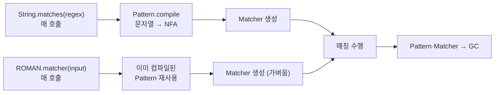
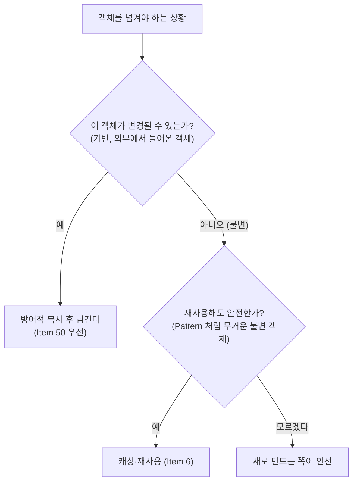

# Item 6. 불필요한 객체 생성을 피하라

> 본 문서는 책의 개념 설명을 따라가되, **예시 코드는 이 프로젝트에 작성한 소스**(`RomanNumerals`, `BadRomanNumerals`, `AutoBoxingCost`)로 대체한다.

## 핵심 요약

**같은 기능을 하는 객체를 매번 새로 만들지 말고 재사용하라.** 한 번 만들어두면 되는 객체를 반복해서 새로 만들면 성능이 깎인다. 특히 **생성 비용이 큰 객체**(정규식 Pattern, DB 커넥션 등)를 매번 새로 만드는 것이 가장 흔한 원인이다.

| 사례 | 매번 생성 (잘못됨) | 재사용 (정답) | 비고 |
|---|---|---|---|
| 문자열 | `new String("hi")` | `"hi"` (리터럴) | 문자열 풀 재사용 |
| Boolean | `new Boolean(true)` | `Boolean.valueOf(true)` | 캐싱된 인스턴스 반환 |
| 정규식 | `input.matches(regex)` | `static final Pattern ROMAN` | **이 프로젝트 실습** |
| 숫자 누적 | `Long sum = 0L; sum += i` | `long sum = 0; sum += i` | 오토박싱 회피 |

**주의**: "객체 생성은 비싸니 무조건 피하자"가 **아니다**. 현대 JVM에서 가벼운 객체의 생성/회수는 거의 공짜다. 객체 풀(pool)을 쓰거나 캐싱해야 할 정도로 무거운 객체에만 이 원칙을 적용한다. 그리고 **방어적 복사가 필요한 곳에서 재사용하면 보안/정확성 버그가 생긴다**(Item 50).

---

## 잘못된 예 (1): 매번 Pattern 을 컴파일하는 String.matches()

`BadRomanNumerals.java`

```java
public final class BadRomanNumerals {

    private static final String ROMAN_PATTERN =
            "^(?=.)M*(C[MD]|D?C{0,3})(X[CL]|L?X{0,3})(I[XV]|V?I{0,3})$";

    public static boolean isRomanNumeral(String input) {
        return input.matches(ROMAN_PATTERN);   // ← 매 호출마다 Pattern.compile() 실행
    }
}
```

`String.matches(String regex)` 의 내부 구현은 대략 이렇다:

```java
// String.matches() 의 의사(pseudo) 구현
public boolean matches(String regex) {
    return Pattern.compile(regex).matcher(this).matches();
    //       ^^^^^^^^^^^^^^^^^^^^ 매번 새 Pattern 객체 생성 + 컴파일
}
```

`Pattern.compile()` 은 정규식 **문자열을 해석해 유한 상태 기계(NFA)를 구축**하는 작업이다. 문자열이 복잡할수록(우리 예제의 로마 숫자 정규식처럼) 컴파일 비용이 크다. 그런데 `String.matches()` 는 호출될 때마다 이 컴파일을 반복한다. Pattern 객체는 만들어지고, 한 번 매칭에 쓰인 뒤, 곧바로 GC 대상이 된다.

---

## 올바른 예: Pattern 을 static final 로 캐싱하기

`RomanNumerals.java` (학습자가 직접 완성한 핵심 부분)

```java
public final class RomanNumerals {

    /** 클래스 로딩 시 정규식을 한 번만 컴파일해 캐싱한다. */
    private static final Pattern ROMAN = Pattern.compile(
            "^(?=.)M*(C[MD]|D?C{0,3})(X[CL]|L?X{0,3})(I[XV]|V?I{0,3})$");

    public static boolean isRomanNumeral(String input) {
        return ROMAN.matcher(input).matches();   // ← 컴파일은 이미 끝남, matcher() 만 생성
    }
}
```

### 왜 `static final` 인가 — 세 가지 이유

| 키워드 | 빠지면 생기는 일 |
|---|---|
| `static` | 인스턴스마다 Pattern 이 따로 생김 → 재사용의 의미 사라짐 |
| `final` | 실수로 다른 Pattern 으로 교체될 위험 |
| (불변성) | Pattern 은 immutable 이라 여러 스레드가 안전하게 공유 가능 |



왼쪽(매번 컴파일)은 매 호출마다 무거운 `compile` 단계를 거치지만, 오른쪽(캐싱)은 클래스 로딩 시 한 번만 `compile` 하고 이후에는 가벼운 `matcher()` 만 만든다.

---

## 실제 성능 측정 결과 (이 프로젝트 테스트)

`Item06Test.PerformanceTest` 에서 동일 입력 `"MCMLXXVII"` (1977) 를 100,000 회 검사:

```
[Item 6 성능] Pattern 캐싱: 31,855,200 ns | 매번 컴파일: 147,674,700 ns | 비율: 4.6배
```

| 구현 | 소요 시간 (10만 회) | 배율 |
|---|---|---|
| `RomanNumerals` (Pattern 캐싱) | 31.9 ms | 1.0× |
| `BadRomanNumerals` (매번 컴파일) | 147.7 ms | **4.6×** |

> 주의: JUnit 의 단순 시간 측정은 JIT 워밍업·GC 영향을 받는다. 정밀 벤치마크는 JMH 를 써야 한다. 다만 4.6배 차이는 교육 목적의 체감용으로 충분히 명확하다.

---

## 잘못된 예 (2): 오토박싱이 만드는 숨은 객체

`AutoBoxingCost.java`

```java
public static long sumPrimitive(long n) {
    long sum = 0;          // 원시 타입
    for (long i = 0; i <= n; i++) {
        sum += i;          // 객체 생성 없음
    }
    return sum;
}

public static long sumBoxed(Long n) {
    Long sum = 0L;         // ← 래퍼 타입
    for (long i = 0; i <= n; i++) {
        sum += i;          // i(long) → Long 으로 오토박싱 → 매 반복마다 Long 인스턴스 생성
    }
    return sum;
}
```

`sum += i` 한 줄이 컴파일러에 의해 이렇게 번역된다:

```java
// sumBoxed 의 sum += i 의 실제 전개 (의사 코드)
sum = Long.valueOf(sum.longValue() + i);
//                    ^^^^^^^^^^^^^^^^ 언박싱    ^^^^^^^^^^^^^^^^^ 언박싱 후 덧셈 결과를 다시 박싱
```

즉 매 반복마다 (1) `sum` 언박싱 (2) `i` 박싱 (3) 결과 박싱 — 불필요한 `Long` 객체가 n 개 만들어진다.

### 실제 측정 결과 (100만 회 누적)

```
[Item 6 오토박싱] long 누적: 1,604,900 ns | Long 누적: 11,658,500 ns | 비율: 7.3배
```

| 누적 변수 타입 | 소요 시간 (100만 회) | 배율 |
|---|---|---|
| `long sum` (원시) | 1.6 ms | 1.0× |
| `Long sum` (래퍼) | 11.7 ms | **7.3×** |

### 교훈: 박스화된 기본 타입을 의도치 않게 쓰지 마라

- 지역 변수는 **원시 타입**(`long`, `int`, `double`)을 쓴다.
- 컬렉션의 원소(`List<Long>`)처럼 어쩔 수 없이 래퍼를 써야 할 때만 래퍼를 쓴다.
- `Long` 캐시는 `-128 ~ 127` 범위만 적중하므로, 그 밖의 값을 반복적으로 오토박싱하면 캐시 혜택도 없다.

---

## 주의: "객체 재사용"과 "방어적 복사"는 충돌한다 (Item 50)

Item 6 의 "재사용하라"는 말에 취해서 **방어적 복사(defensive copy)가 필요한 곳에서 기존 객체를 재사용**하면 안 된다. 이 둘은 충돌하지만, **우선순위**가 다르다:



> 보안·정확성(방어적 복사)이 성능(재사용)보다 **항상** 우선한다. 방어적 복사가 필요한데 재사용을 하면, 외부에서 넘겨받은 가변 객체의 내부 상태가 예상치 못하게 바뀌어 보안 구멍이 생긴다. (Item 50 에서 자세히 다룬다.)

---

## 객체 풀(pool) 은 언제 의미가 있는가

"객체 생성이 비싸니 풀을 만들어 재사용하자"는 생각은 **현대 JVM 에서 대부분 틀렸다**. 가벼운 객체는 직접 새로 만드는 것이 풀에서 꺼내는 것보다 빠르다 (JVM 의 GC 와 할당 최적화가 매우 빠르기 때문).

풀이 의미 있는 **무거운 객체**의 예:
- **DB 커넥션** (`java.sql.Connection`) — TCP 소켓 + 인증 비용이 큼 → 커넥션 풀(HikariCP 등)
- **스레드** (`Thread`) — OS 스레드 생성 비용 → 스레드 풀(ExecutorService)
- **특정 JNI 자원** — 네이티브 객체 생성이 비쌈

즉 "Pattern 컴파일은 static final 캐싱(1개), DB 커넥션은 풀(N개), 일반 객체는 그냥 new" — 대상에 따라 도구가 다르다.

---

## Item 5 와 Item 6 의 관계

| | Item 5 (의존 객체 주입) | Item 6 (불필요한 생성 회피) |
|---|---|---|
| 다루는 문제 | **자원을 어떻게 교체 가능하게** 받을 것인가 | **객체를 언제 새로 만들고 언제 재사용할** 것인가 |
| 핵심 도구 | 생성자 주입 + 인터페이스 타입 | `static final` 캐싱, 정적 팩터리, 원시 타입 선호 |
| 공통점 | 둘 다 **불변(`final`) 객체**를 선호 — Item 17 로 귀결 | 같음 |
| 충돌 지점 | 없음 | Item 50 (방어적 복사)과 우선순위 경쟁 |

Item 5 의 `SpellChecker` 는 `Dictionary` 를 주입받아 "재사용"하고, Item 6 의 `RomanNumerals` 는 `Pattern` 을 캐싱해 "재사용"한다. **"재사용"이라는 단어가 두 아이템의 공통 분모**다 — 차이는 "외부에서 주입받은 자원을 재사용"하느냐, "내부에서 한 번 만든 무거운 객체를 재사용"하느냐.

---

## 이 프로젝트의 산출물

| 파일 | 다루는 핵심 |
|---|---|
| `src/main/java/ch02/item06/RomanNumerals.java` | 학습자 실습 결과: Pattern 을 `static final` 로 캐싱해 재사용 |
| `src/main/java/ch02/item06/BadRomanNumerals.java` | 잘못된 예: `String.matches()` 로 매번 Pattern 컴파일 |
| `src/main/java/ch02/item06/AutoBoxingCost.java` | 오토박싱 숨은 비용: `long` vs `Long` 누적 비교 |
| `src/test/java/ch02/item06/Item06Test.java` | 기능 동일성 검증 + 성능 비교 (4.6배, 7.3배) |

---

## 핵심 정리

> 같은 기능을 하는 객체를 매번 새로 만들지 말고 재사용하라. 특히 **정규식 `Pattern`**, **DB 커넥션**, **무거운 팩터리 객체**처럼 생성 비용이 큰 객체는 한 번 만들어 `static final` 로 보관한다. 지역 변수는 **원시 타입**을 써서 오토박싱을 피한다. 단, **가벼운 객체**의 생성 비용은 현대 JVM 에서 거의 공짜이므로 객체 풀까지 만들 필요는 없다. 그리고 **방어적 복사가 필요한 곳에서는 반드시 복사**해야 한다 — Item 50 (보안/정확성)이 Item 6 (성능)보다 항상 우선한다.

---

## Java 17 시대의 관점

- **`Pattern.compile()` 은 여전히 무겁다.** JDK 17 에서도 정규식 엔진 구조 자체가 바뀌지 않았으므로, 이 프로젝트의 4.6배 차이는 유효하다.
- **`record` 와 캐싱의 조합**: 불변 캐시 객체를 `record` 로 정의하면 `final` 필드 + 동등성이 자동으로 보장되어 캐시 키로 쓰기 좋다.
- **JMH (Java Microbenchmark Harness)**: 이 프로젝트의 단순 시간 측정은 교육용이다. 실무에서 성능을 주장하려면 JMH 로 JIT 워밍업·포크·블랙홀을 제어해야 한다. ("마이크로벤치마크는 함정이 많다"는 것 자체가 Item 6 의 숨은 교훈이다.)
- **오토박싱은 '보이지 않는 new'**: 코드 리뷰에서 `Long`/`Integer` 지역 변수가 루프 안에 있으면 의심하라. 가장 흔하면서도 발견하기 어려운 성능 함정이다.