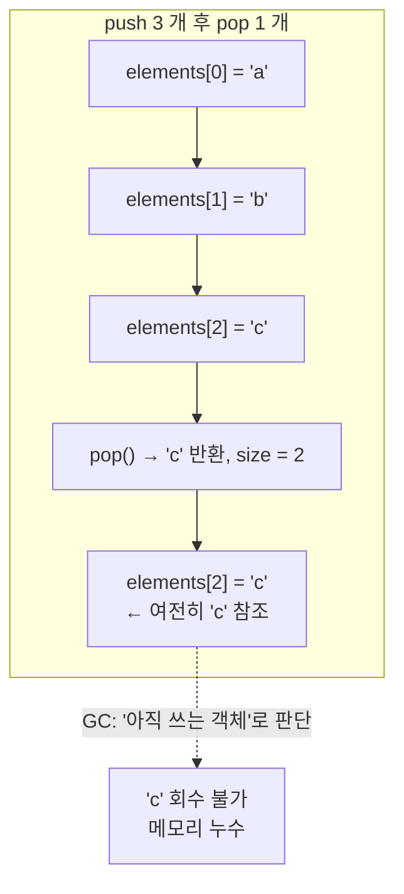
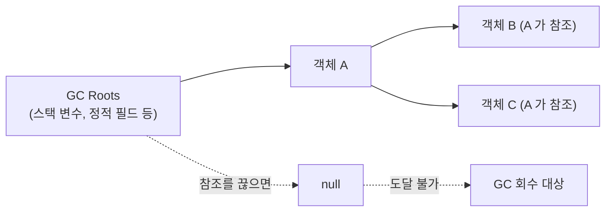

# Item 7. 다 쓴 객체 참조를 해제하라

> 본 문서는 책의 개념 설명을 따라가되, **예시 코드는 이 프로젝트에 작성한 소스**(`LeakyStack`, `Stack`)로 대체한다.

## 핵심 요약

**GC(Garbage Collector)는 자동으로 메모리를 관리해 주지만, "여전히 참조하고 있는" 객체는 회수하지 못한다.** 그래서 프로그래머가 "다 썼는데도 참조가 남아있는" 객체를 만들면 메모리 누수(memory leak)가 생긴다. 이를 **다 쓴 객체 참조(obsolete reference)** 라고 부른다.

| 누수 원인 | 설명 | 해결책 |
|---|---|---|
| **(1) 자기 메모리를 직접 관리하는 클래스** | 배열·버퍼를 직접 운영하는 스택·큐·풀 | **다 쓴 슬롯을 `null` 처리** (**이 프로젝트 실습**) |
| **(2) 캐시** | 키를 넣고 잘 안 빼면 캐시가 무한히 큼 | `WeakHashMap`, `LinkedHashMap.removeEldestEntry`, `ScheduledExecutor` 주기적 청소 |
| **(3) 리스너·콜백** | 클라이언트가 등록만 하고 해지를 안 하면 콜백이 쌓임 | 약한 참조(`WeakReference`)로 보관 — GC 가 회수 가능 |

이 프로젝트는 **(1) 스택** 사례를 코드로 직접 다룬다.

---

## 잘못된 예: 참조를 해제하지 않는 스택

`LeakyStack.java`

```java
public Object pop() {
    if (size == 0) {
        throw new EmptyStackException();
    }
    return elements[--size];   // ← size 만 줄이고, 배열 슬롯은 가만히 둔다
}
```

이 코드는 **기능적으로는 올바르다** — LIFO 순서대로 원소를 꺼낸다. 하지만 **메모리 관리**에서 실패한다.

### 무엇이 문제인가

`elements[--size]` 가 실행된 뒤에도, 그 슬롯(`elements[size]`)은 **여전히 꺼낸 객체를 가리키고 있다**. 배열의 유효 영역은 `0..size-1` 이지만, 자바 배열은 "과거에 들어있던 값"을 저절로 지워주지 않는다.



스택이 커졌다 줄어들면, 줄어든 만큼의 객체가 **"다 썼는데도" 살아있게** 된다. 최대 크기만큼의 객체가 쓰레기로 쌓이는 셈이다.

---

## 올바른 예: 다 쓴 참조를 `null` 로 해제

`Stack.java` (학습자가 직접 완성한 핵심 부분)

```java
public Object pop() {
    if (size == 0) {
        throw new EmptyStackException();
    }
    size--;
    Object result = elements[size];
    elements[size] = null;   // ← 다 쓴 참조 해제 — GC 가 회수할 수 있게
    return result;
}
```

한 줄(`elements[size] = null`)이 추가됐을 뿐이지만, 이 한 줄이 **GC 가 "이 객체는 더 쓸모없다"고 판단하는 근거**가 된다.

### 두 구현의 차이 — 테스트로 관찰

`Item07Test.StackReferenceReleaseTest` 에서 `pop()` 직후 해당 슬롯을 관찰한다:

```java
int topIndex = stack.size() - 1;   // pop 직전 꼭대기 인덱스
stack.pop();

assertThat(stack.elementAt(topIndex))
        .as("pop() 후 해당 슬롯은 null 이어야 한다 (다 쓴 참조 해제)")
        .isNull();                 // Stack: 통과 / LeakyStack: 실패
```

대조군 `LeakyStackTest.leakyStack_keepsReferenceAfterPop`는 LeakyStack 이 **일부러 참조를 남긴다는 것**을 보여준다 — 이것이 바로 메모리 누수의 모습이다.

---

## 왜 `null` 처리가 필요한가 — GC 와 참조의 관계

자바의 GC는 **"도달 가능성(reachability)"** 로 객체의 생사를 판단한다.



- **GC Root** (지역 변수, 정적 필드, 스레드) 에서 출발해 **참조 사슬**을 따라갈 수 있는 객체는 "살아있다"
- 참조 사슬이 끊긴 객체는 "죽었다" — GC 가 회수한다

스택 배열(`elements`)은 **인스턴스 필드**, 즉 GC Root 에서 도달 가능하다. 그래서 `elements[i]` 가 어떤 객체를 가리키고 있으면, 그 객체는 **배열이 살아있는 한 계속 살아있다** — 프로그래머가 `elements[i] = null` 로 참조를 끊어주지 않는 한.

> C/C++ 에서는 프로그래머가 직접 메모리를 해제(`free`/`delete`) 한다. 자바는 GC 가 해주지만, **참조를 끊는 책임**은 여전히 프로그래머에게 있다. 이것이 Item 7 의 본질이다.

---

## `null` 처리는 언제 필요한가 — 자기 메모리를 직접 관리할 때만

"모든 지역 변수를 다 쓰자마자 `null` 로 만들라"는 **오해**다. 대부분의 경우 `null` 처리는 불필요하다:

| 상황 | `null` 처리 필요? | 이유 |
|---|---|---|
| 지역 변수가 메서드 끝에서 자연스럽게 스코프를 벗어남 | ❌ | 스코프가 끝나면 GC가 자동 회수 |
| `List<Object>` 에 넣고 관리하는 객체 | ❌ | 컬렉션 프레임워크가 알아서 관리 (`remove`, clear 등) |
| **직접 만든 배열/버퍼** (`Object[] elements`) 에 넣고 빼는 객체 | ✅ | 배열은 "빈 칸"을 자동으로 null 로 만들지 않음 |
| 캐시에 넣고 잘 안 빼는 객체 | ✅ (간접) | `WeakHashMap` 이나 주기적 청소 필요 |
| 리스너로 등록만 하고 해지 안 하는 콜백 | ✅ (간접) | 약한 참조(`WeakReference`) 로 보관 |

즉, **"GC 가 못 보는 곳에서 참조를 숨기는"** 코드를 직접 작성했을 때만 `null` 처리가 의미가 있다. 일반적인 객체 지향 코드에서는 스코프와 컬렉션 API 에 맡기면 충분하다.

> 책의 조언: "객체 참조를 `null` 처리하는 일은 예외적인 경우지, 일상적인 일이 되어서는 안 된다." `null` 처리로 코드를 더럽히는 대신, **변수의 스코프를 최소화**(Item 57) 하는 것이 근본 해결책이다.

---

## 캐시와 리스너의 메모리 누수 (간략)

이 프로젝트에서 직접 코드를 작성하지는 않지만, 책이 언급하는 나머지 두 사례를 짚고 넘어간다.

### (2) 캐시

```java
// 잘못된 예: 캐시에 넣고 절대 안 빼면 무한히 큰다
Map<Key, Value> cache = new HashMap<>();
cache.put(key, value);   // 나중에 안 쓰더라도 영원히 살아있음
```

해결책:
- **`WeakHashMap`**: 키가 강하게 참조되지 않으면 엔트리 전체를 GC 가 회수 (캐시 수명이 외부 참조와 연동될 때 적합)
- **`LinkedHashMap.removeEldestEntry`**: 새 엔트리를 넣을 때 가장 오래된 것을 자동 제거
- **`ScheduledExecutor` / 백그라운드 스레드**: 주기적으로 만료된 엔트리 청소 (시간 기반 만료)

### (3) 리스너·콜백

```java
// 잘못된 예: 클라이언트가 콜백을 등록만 하고 해지를 안 하면 누적됨
list.addCallback(callback);   // 콜백 인터페이스를 강한 참조로 보관
```

해결책: 콜백을 **약한 참조**(`WeakReference<Callback>`) 로 보관 — 클라이언트가 콜백 참조를 버리면 GC 가 회수. 또는 명시적인 `removeCallback` API 를 제공하고 클라이언트가 책임지게 한다.

---

## GC Root 와 참조 유형 (보충)

자바는 참조의 "강도"를 4 단계로 나눈다:

| 참조 유형 | GC 회수 시점 | 전형적 용도 |
|---|---|---|
| **Strong** (일반 참조) | 절대 회수 안 함 (도달 가능한 한) | 일반적인 객체 참조 |
| **Soft** (`SoftReference`) | 메모리가 부족할 때 | 메모리 민감 캐시 |
| **Weak** (`WeakReference`) | 다음 GC 사이클에 | `WeakHashMap` 의 키, 리스너 보관 |
| **Phantom** (`PhantomReference`) | 객체가 finalize 된 뒤 | 자원 정리 모니터링 |

`WeakHashMap` 은 키를 `WeakReference` 로 보관해서, **키에 대한 외부 참조가 사라지면** 엔트리 전체를 회수한다. 이게 "캐시 수명 = 외부 참조 수명" 이라는 시맨틱을 만든다.

---

## 이 프로젝트의 산출물

| 파일 | 다루는 핵심 |
|---|---|
| `src/main/java/ch02/item07/LeakyStack.java` | 잘못된 예: 참조를 해제하지 않는 스택 (메모리 누수) |
| `src/main/java/ch02/item07/Stack.java` | 올바른 예: `pop()` 에서 `elements[size] = null` 로 참조 해제 (**학습자 실습 결과**) |
| `src/test/java/ch02/item07/Item07Test.java` | 기능 정확성 + 참조 해제 검증 + LeakyStack 대조군 |

---

## Item 6 와 Item 7 의 관계

| | Item 6 (불필요한 생성 회피) | Item 7 (다 쓴 참조 해제) |
|---|---|---|
| 다루는 문제 | 객체를 **언제 새로 만들고 언제 재사용할** 것인가 | 객체를 **다 쓴 뒤 어떻게 회수되게 할** 것인가 |
| 핵심 도구 | `static final` 캐싱, 원시 타입 선호 | `null` 처리, `WeakHashMap`, 스코프 최소화 |
| 공통 분모 | 둘 다 **메모리·성능** 을 다룬다 | 같음 |
| 대비 | "만들지 말고 재사용" | "다 썼으면 참조를 끊어" |

한 객체의 **생성**(Item 6)과 **해제**(Item 7) 양면 — 책의 2 장 "객체의 생성과 파괴" 가 이 둘을 짝으로 배치한 이유다.

---

## 핵심 정리

> 자바에도 메모리 누수는 있다. GC 가 회수하려면 **참조가 끊겨야 한다**. 가장 흔한 원인 세 가지: **(1) 자기 메모리를 직접 관리하는 클래스** (배열 슬롯을 `null` 처리), **(2) 캐시** (`WeakHashMap` 또는 주기적 청소), **(3) 리스너·콜백** (약한 참조로 보관). `null` 처리는 "직접 관리하는 메모리"에서만 예외적으로 쓰고, 일상적인 코드에서는 **변수 스코프를 최소화**(Item 57) 하는 것이 근본 해결책이다. 누수가 의심되면 힙 프로파일러(`jmap`, VisualVM, JFR) 로 확인하라 — 눈에 잘 안 보이는 버그다.