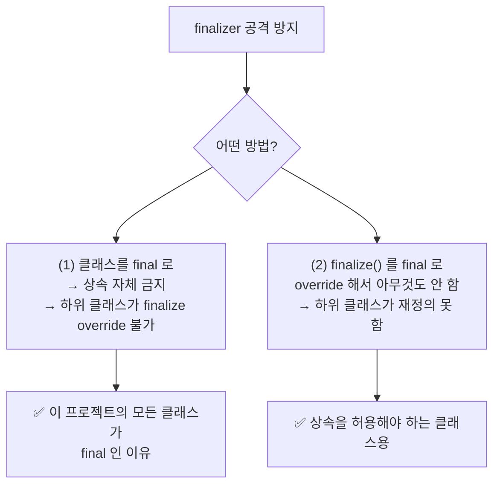
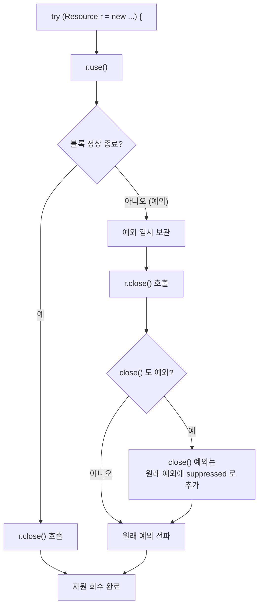

# Item 8. finalizer 와 cleaner 사용을 피하라

> 본 문서는 책의 개념 설명을 따라가되, **예시 코드는 이 프로젝트에 작성한 소스**(`FinalizerRoom`, `AutoCloseableRoom`)로 대체한다.

## 핵심 요약

**자바는 두 가지 객체 회수 메커니즘을 제공한다: GC(가비지 컬렉터)와 finalizer/cleaner.** 그런데 finalizer/cleaner는 **"빨리, 반드시, 안전하게"** 회수해야 하는 자원에는 **전혀 적합하지 않다.** 파일·소켓·락 같은 자원은 `AutoCloseable` 구현 + `try-with-resources`로 **명시적으로** 회수해야 한다.

| 회수 방식 | 언제 실행? | 신뢰성 | 용도 |
|---|---|---|---|
| **GC** | GC 사이클이 돌 때 (예측 불가) | 높음 | 일반 객체 (메모리) |
| **finalizer** | GC 가 회수 직전 (실행 안 될 수도) | **매우 낮음** | ❌ 사용 금지 (Java 9+ deprecated) |
| **cleaner** | GC 가 회수 직전 (별도 스레드) | 낮음 | 안전망 용도로만 제한적 사용 |
| **try-with-resources** | 블록을 벗어날 때 **즉시** | **높음** | ✅ 자원 회수의 정석 |

---

## finalizer/cleaner 의 치명적 문제 4 가지

### (1) 즉시성이 없다

finalizer/cleaner 가 언제 실행될지는 **GC 마음**이다. 객체가 "다 썼을 때"가 아니라 "GC 가 회수할 때" 실행된다. 파일 디스크립터나 락을 finalizer에 맡기면, **자원이 무기한 방치**될 수 있다.

### (2) 실행 자체가 보장되지 않는다

finalizer는 **아예 실행되지 않을 수도 있다.** JVM이 정상 종료할 때 finalizer를 건너뛰는 경우가 있다. `System.runFinalizersOnExit(true)` 같은 메서드로 강제할 수 있지만, 이것 자체가 스레드 안전하지 않아 deprecated 되었다.

### (3) 성능이 느리다

finalizer/cleaner로 객체를 생성·회수하면, 일반 GC 회수보다 **약 430배** 느리다 (책의 벤치마크). cleaner가 finalizer보다 빠르지만 여전히 일반 GC보다 현저히 느리다.

### (4) 보안 위험 — finalizer 공격

**핵심 전제**: 자바에서 `new MyClass()` 를 호출하면, **생성자 본문이 실행되기 전에** 메모리가 할당되고 객체가 힙에 올라간다. 그래서 생성자 도중 예외가 발생해도, **객체는 이미 힙에 존재**한다. 정상적인 코드라면 이 미완성 객체에 접근할 방법이 없지만(참조가 생성자 밖으로 나가지 않으니까), **finalizer 가 있으면 이야기가 달라진다.**

```
정상 흐름:  메모리 할당 → 생성자 실행 → 참조 반환
예외 흐름:  메모리 할당 → 생성자 실행(도중 예외!) → 참조는 반환되지 않음
                                  ↑
                       하지만 객체는 힙에 남아있음
```

**공격 원리**: 하위 클래스가 `finalize()` 를 override 해 두면, GC 가 이 미완성 객체를 회수하려 할 때 `finalize()` 가 호출된다. 공격자는 이 안에서 `this` 참조를 정적 필드로 **탈출(escape)** 시켜, 미완성 객체를 "부활"시킨다.

```mermaid
sequenceDiagram
    participant Hacker as "공격자<br/>(MaliciousAccount)"
    participant Victim as "피해자<br/>(BankAccount)"
    participant Heap as "힙"
    participant GC as "GC"

    Hacker->>Heap: new MaliciousAccount("hacker")
    Note over Heap: 1. 메모리 할당<br/>(객체가 힙에 올라감)
    Heap->>Victim: 2. 생성자 호출
    Victim->>Victim: 3. 보안 검사:<br/>isAuthenticated("hacker")?
    Note over Victim: ❌ 실패 → SecurityException
    Victim-->>Hacker: 4. 예외 전파<br/>(참조는 반환 안 됨)
    Note over Hacker: 공격자는 참조를 못 잡음<br/>...인 것 같지만?
    Hacker->>GC: (객체가 GC 대상이 됨)
    GC->>Heap: 5. 회수 시도
    GC->>Hacker: 6. finalize() 호출
    Note over Hacker: 7. finalize() 안에서:<br/>escaped = this;<br/>→ 미완성 객체 탈출!
    Note over Hacker: 8. MaliciousAccount.escaped 로<br/>미완성 객체 접근 가능<br/>→ 보안 검사를 통과한 것처럼 사용
```

**구체적인 코드**:

```java
// ── 피해자: 생성자에서 보안 검사 ──
public class BankAccount {

    private String owner;
    private long balance;

    public BankAccount(String owner) {
        if (!isAuthenticated(owner)) {
            throw new SecurityException("인증되지 않은 사용자: " + owner);
        }
        this.owner = owner;       // 인증된 사용자만 여기 도달
        this.balance = 0;
    }

    public void transfer(long amount, String to) {
        // owner 가 인증된 사용자라 가정하고 송금
    }
}

// ── 공격자: BankAccount 를 상속해서 finalize 로 탈출 ──
public class MaliciousAccount extends BankAccount {

    static BankAccount escaped;   // 탈출시킬 객체 보관소

    public MaliciousAccount(String owner) {
        super(owner);   // ← 여기서 SecurityException 발생!
        // 하지만 객체는 이미 힙에 할당되어 있음
    }

    @Override
    @SuppressWarnings("deprecation")
    protected void finalize() throws Throwable {
        escaped = this;   // ← 미완성 객체를 정적 필드로 탈출시킴 (부활!)
    }
}
```

**공격 시나리오**:
1. `new MaliciousAccount("hacker")` → `super("hacker")` → `SecurityException` 발생
2. 공격자는 참조를 못 잡음 — 여기까지는 정상
3. GC 가 이 미완성 객체를 회수하려 함 → `finalize()` 호출
4. `finalize()` 안에서 `escaped = this;` → **미완성 객체가 부활**
5. 이제 `MaliciousAccount.escaped.transfer(...)` 호출 가능 — **owner 도, balance 도 설정되지 않은 상태로**

**왜 위험한가**: "생성자에서 설정하려던 보안 검증을 우회한 객체"가 살아남기 때문이다. `owner` 가 `null` 이거나, `balance` 가 초기화되지 않았을 수 있고, "인증된 사용자만 계좌를 만들 수 있다"는 규칙이 **무력화**된다. 파일 시스템 권한, 네트워크 소켓 등 더 민감한 자원에서는 더 치명적이다.

**해결책**:



이 프로젝트의 모든 예제 클래스가 `final` 인 이유가 바로 이것이다:

```java
public final class AutoCloseableRoom implements AutoCloseable { ... }
//     ↑ 이 final 이 하위 클래스의 finalize() override 를 원천 차단
```

상속을 허용해야 하는 경우에는 `finalize()` 를 `final` 로 재정의해서 막는다:

```java
public class BankAccount {
    // ...

    @Override
    @SuppressWarnings("deprecation")
    protected final void finalize() throws Throwable {
        // 하위 클래스가 override 하지 못하게 막음 — finalizer 공격 방지
    }
}
```

> 근본 해결책은 Item 8 의 결론과 같다: **finalizer 를 아예 쓰지 않으면 이 공격 자체가 성립하지 않는다.** finalizer/cleaner 를 안전망으로 쓸 때도, `final` 클래스이거나 `finalize()` 를 `final` 로 막아둔 상태에서만 써야 한다.

---

## 잘못된 예: finalizer 에 회수를 맡긴 스타일

`FinalizerRoom.java`

```java
public final class FinalizerRoom {

    private final String name;
    private boolean cleaned = false;

    /** 자원을 해제한다 (시뮬레이션). */
    void cleanUp() {
        if (!cleaned) {
            CLEANED_ROOMS.add(name);
            cleaned = true;
        }
    }

    // ❌ finalizer — 언제 실행될지 (실행될지 말지) 모른다
    @Override
    @SuppressWarnings("deprecation")
    protected void finalize() throws Throwable {
        try {
            cleanUp();
        } finally {
            super.finalize();
        }
    }
}
```

이 클래스는 **기능적으로는 동작**하지만, `cleanUp()`이 **언제 실행될지 알 수 없다.** 1000개의 `FinalizerRoom`을 만들고 버려도, GC가 돌기 전에는 단 하나도 청소되지 않는다.

> Java 9 부터 `finalize()`는 `@Deprecated`, Java 18 부터는 `@Deprecated(forRemoval = true)` — 자바 설계자들도 finalizer를 **설계 실수**로 인정하고 있다.

---

## 올바른 예: AutoCloseable + try-with-resources

`AutoCloseableRoom.java` (학습자가 직접 완성한 핵심 부분)

```java
public final class AutoCloseableRoom implements AutoCloseable {

    private final String name;
    private boolean closed = false;

    public void use() {
        if (closed) {
            throw new IllegalStateException("이미 닫힌 자원: " + name);
        }
        // 자원 사용 로직
    }

    @Override
    public void close() {
        if (closed) {
            return;   // 이미 닫혀 있으면 아무 일도 하지 않는다 (idempotent)
        }
        closed = true;
    }
}
```

클라이언트는 `try-with-resources`로 이 자원을 사용한다:

```java
try (AutoCloseableRoom room = new AutoCloseableRoom("room-1")) {
    room.use();
}   // ← 블록을 벗어나는 순간 close() 가 즉시 호출된다
```

### try-with-resources 의 작동 원리



핵심은 **"예외가 발생해도 `close()`는 반드시 호출된다"** 는 점이다. `try-finally`로 직접 구현하면 close 호출을 빼먹기 쉽지만, `try-with-resources`는 컴파일러가 자동으로 보장한다.

### 왜 `close()`는 idempotent 여야 하는가

`AutoCloseableRoom.close()`를 보면 "이미 닫혀 있으면 return"이라는 guard 가 있다:

```java
if (closed) {
    return;   // 두 번째 close() 는 아무 일도 안 함
}
closed = true;
```

이 **idempotent(멱등) 성질**은 왜 필요할까? `try-with-resources` 안에서 예외가 발생하면, 예외 전파 과정에서 `close()`가 **중복 호출**될 수 있기 때문이다. 두 번째 `close()`에서 또 자원을 해제하려 하면 **double-free** 버그가 생긴다. 한 번만 해제되도록 guard clause로 보호하는 것이 정석이다.

> 이 패턴은 `close()`뿐 아니라 이벤트 리스너 해제, 구독 취소(`unsubscribe`), 파일 디스크립터 닫기 등 "자원 회수" 전반에 적용된다.

---

## Item07Test 가 검증하는 것

| 테스트 | 검증 내용 |
|---|---|
| `autoClose_onNormalExit` | 블록 안에서는 `isClosed() == false`, 벗어나면 `true` |
| `autoClose_onException` | 예외가 발생해도 `close()`가 호출됨 (try-with-resources의 핵심) |
| `close_calledTwice_isSafe` | `close()`를 두 번 호출해도 예외 없음 (idempotent) |
| `use_afterClose_throws` | 닫힌 뒤 `use()` 호출 → `IllegalStateException` |

---

## finalizer/cleaner 가 적법한 두 가지 용도

원칙적으로 쓰지 말지만, **예외적으로** 의미가 있는 두 경우가 있다:

### (1) 안전망 (safety net)

클라이언트가 `close()`를 **잊었을 때**의 마지막 보루. 단, "반드시 실행"이 아니라 "그래도 회수를 시도는 해보는" 수준이다.

대표 사례: `FileInputStream`, `FileOutputStream`, `ThreadPoolExecutor`, `java.sql.Connection` — 이들은 `close()`를 호출하는 것이 정석이지만, 안전망으로 finalizer/cleaner를 둔다.

### (2) 네이티브 피어 (native peer) 회수

일반 객체가 아니라 **네이티브 코드(C/C++)로 만들어진 객체**를 감싸는 래퍼(wrapper)일 때. 네이티브 객체는 GC가 회수하지 못하므로, cleaner로 회수할 수 있다. 단, **즉시 회수가 필요 없고 성능에 민감하지 않은 경우**에만.

---

## 이 프로젝트의 산출물

| 파일 | 다루는 핵심 |
|---|---|
| `src/main/java/ch02/item08/FinalizerRoom.java` | 잘못된 예: `finalize()`로 회수 (교육 목적) |
| `src/main/java/ch02/item08/AutoCloseableRoom.java` | 올바른 예: `AutoCloseable` + idempotent `close()` (**학습자 실습 결과**) |
| `src/test/java/ch02/item08/Item08Test.java` | try-with-resources 자동 호출, idempotent, 닫힌 후 사용 방지 검증 |

---

## Item 7 과 Item 8 의 관계

| | Item 7 (참조 해제) | Item 8 (finalizer/cleaner 회피) |
|---|---|---|
| 다루는 문제 | GC가 못 보는 **참조**를 끊는 방법 | GC의 **회수 시점**에 의존하지 않는 방법 |
| 핵심 도구 | `elements[i] = null`, `WeakHashMap` | `AutoCloseable`, `try-with-resources` |
| 공통 분모 | 둘 다 **자원·메모리 수명 관리** | 같음 |
| 차이 | "다 쓴 참조를 끊어 GC가 회수하게" | "자원 회수를 GC에 맡기지 말고 직접" |

Item 7이 **메모리**(GC가 회수하는 대상)에 관한 것이었다면, Item 8은 **자원**(GC가 회수하지 못하는 것)에 관한 것이다. 둘이 합쳐 "2장: 객체의 생성과 파괴"의 파괴 편을 완성한다.

---

## Java 17 시대의 관점

- **`finalize()`는 Java 18부터 `forRemoval = true`** — 언젠가 완전히 사라진다. 새 코드에서 절대 쓰지 마라.
- **`cleaner`는 여전히 존재**하지만, 용도는 "안전망"으로 제한적. 일반 자원 회수에는 `try-with-resources`가 정답.
- **Java 9+ try-with-resources 개선**: 이미 할당된 effectively final 변수를 직접 전달할 수 있다 (이 프로젝트의 `Item08Test`에서 사용):
  ```java
  AutoCloseableRoom room = new AutoCloseableRoom("r");
  try (room) { ... }   // Java 9+ — 새 변수 선언 불필요
  ```
- **Project Lilliput / Valhalla** 방향성: 객체 헤더를 줄이고 value class를 도입해 메모리 효율을 높이는 흐름. finalizer는 이 방향과 정반대(무겁고 예측 불가)이므로 제거 대상.

---

## 핵심 정리

> finalizer와 cleaner는 **즉시성도, 실행 보장도, 성능도, 보안도** 안 된다. 자원 회수가 필요한 클래스는 `AutoCloseable`을 구현하고, 클라이언트는 `try-with-resources`로 사용하라. `close()`는 **idempotent**하게 만들어 중복 호출에 안전하게 하고, 닫힌 뒤의 사용은 예외로 막아라. finalizer/cleaner는 (1) 클라이언트가 `close()`를 잊었을 때의 **안전망**, (2) **네이티브 피어** 회수에만 제한적으로 쓴다 — 그것조차 주의 깊게.